# GameOfThrone2
### Game of Thrones
Consuming Game of Thrones API to demonstrate offline caching using the Network Bound Resource and Room Database

#### Project characteristics

This project brings to table set of best practices, tools, and solutions:

* 100% Kotlin
* Model-View-View Model Architecture
* Dependency Injection
* Material design
* Room local persistence
* Network Bound Resource
* Light Theme and Dark Theme

#### Tech-stack

This project takes advantage of many popular libraries and tools of the Android ecosystem. Most of
the libraries are in the stable version.

* Tech-stack
    * [Kotlin](https://kotlinlang.org/)
        + [Coroutines](https://kotlinlang.org/docs/reference/coroutines-overview.html) - To perform
          background operations
    * [Dagger Hilt](https://dagger.dev/hilt/) - For dependency injection
    * [Jetpack](https://developer.android.com/jetpack)
        * [Lifecycle](https://developer.android.com/topic/libraries/architecture/lifecycle) -
          Performs various actios when lifecycle state changes
        * [ViewModel](https://developer.android.com/topic/libraries/architecture/viewmodel) - Stores
          and manages UI-related data
    * [Room](https://developer.android.com/training/data-storage/room) - Persists data fetched from the API 
    * [View Pager 2](https://developer.android.com/guide/navigation/navigation-swipe-view-2) - For creating scwipable screens like when onboarding
    * [Retrofit](https://github.com/square/retrofit) for making network calls.
* Architecture
    * [MVVM](https://developer.android.com/jetpack/guide?gclid=CjwKCAiAvaGRBhBlEiwAiY-yMLJgFw8dtzM8r78wKMlnykKhTDwh5vx4ZOGqGBbXQ8PEFlYsS_b_oBoCRGoQAvD_BwE&gclsrc=aw.ds)
        - Makes it easier to write modular, reusable and easy to test code
    * [Android Architecture components](https://developer.android.com/topic/libraries/architecture). An app architecture defines the boundaries between parts of the app and the responsibilities each part should have. 
    * [ViewModel](https://developer.android.com/topic/libraries/architecture/viewmodel)
    * [Network Bound Resource](https://medium.com/android-news/making-android-jetpacks-networkboundresource-work-in-offline-mode-fd06ef545ec1). This abstract class provide an easy interface to fetch resource from both the database and the network. It works well with the [Android architecture component](https://developer.android.com/topic/architecture).

#### Getting started

1. Android Studio -> File -> New -> From Version control -> Git
2. Enter `https://github.com/jerimkaura/GoT.git` into URL field

### Application screenshots

#### Light Theme

Onboarding Screen 1           |  Onboarding Screen 2             | Onboarding Screen 3             |
:-------------------------:|:-------------------------:|:-------------------------:|
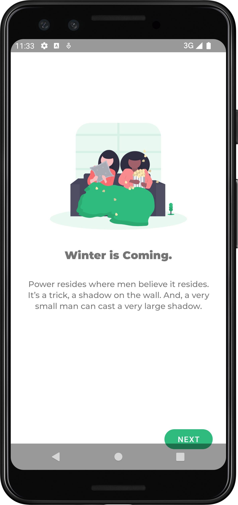  |  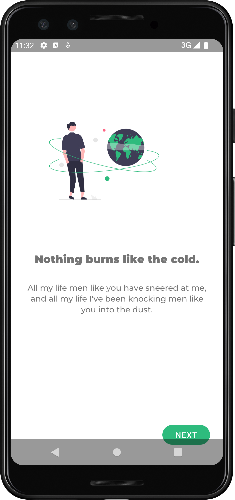|  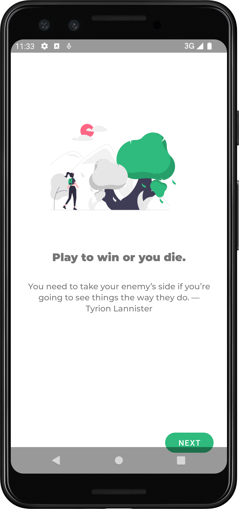| 
Save Username          |  Home Page           | Single Character            |
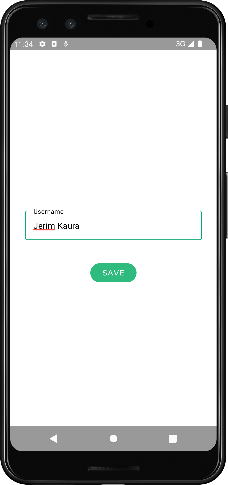  |  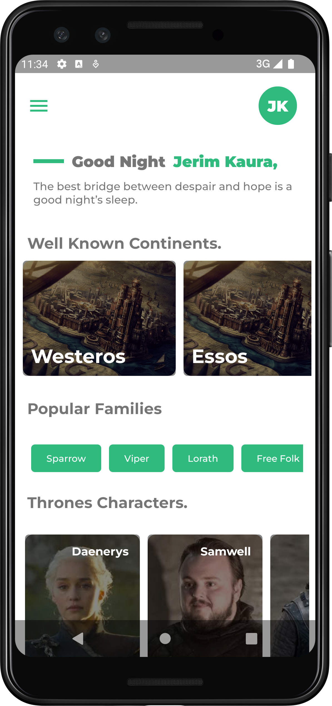|  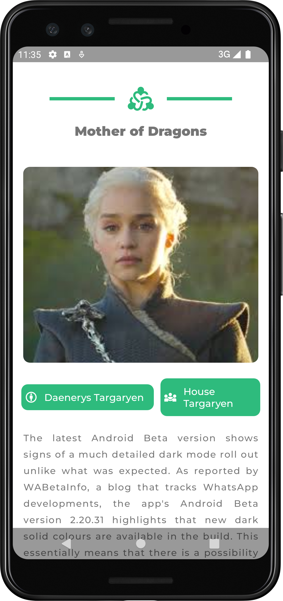| 

#### Dark Theme
Onboarding Screen 1           |  Onboarding Screen 2             | Onboarding Screen 3             |
:-------------------------:|:-------------------------:|:-------------------------:|
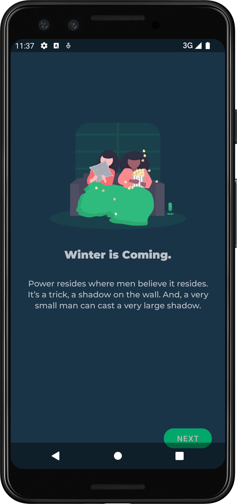  |  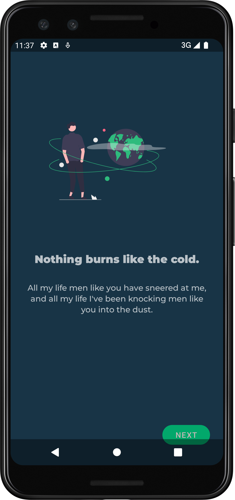|  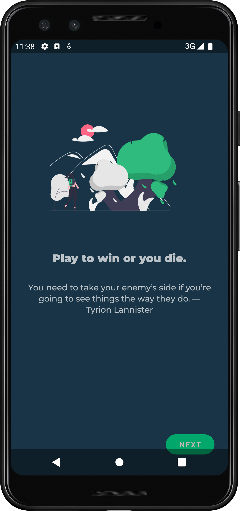| 
Save Username          |  Home Page           | Single Character            |
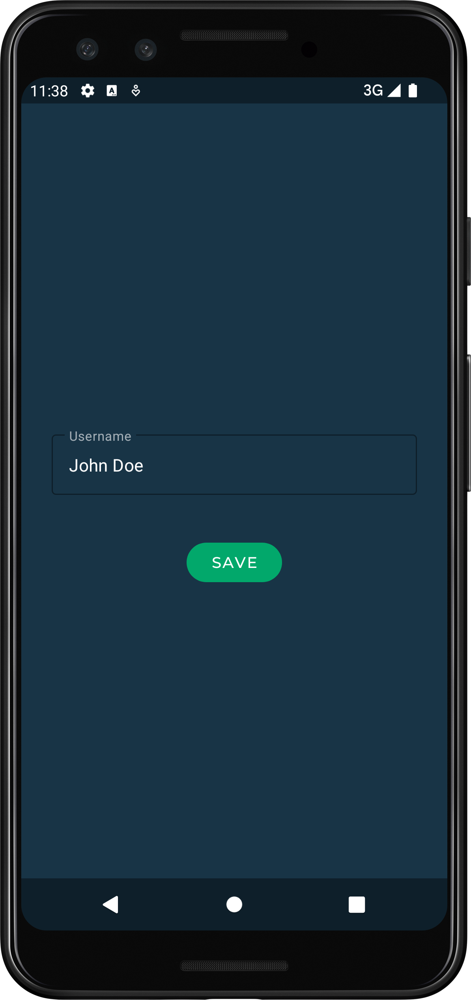  |  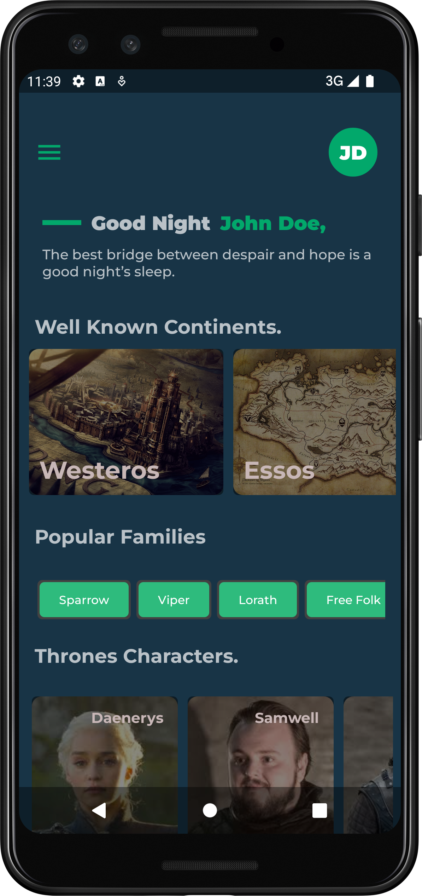|  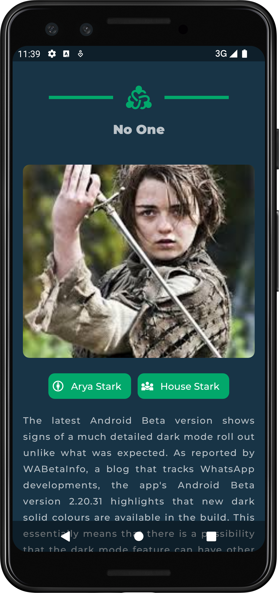| 


#### License

 ```
 MIT License
 
 Copyright (c) 2022 Juma Paul
 
 Permission is hereby granted, free of charge, to any person obtaining a copy of this software and 
 associated documentation files (the "Software"), to deal in the Software without restriction, including 
 without limitation the rights to use, copy, modify, merge, publish, distribute, sublicense, and/or sell 
 copies of the Software, and to permit persons to whom the Software is furnished to do so, subject to 
 the following conditions:
 
 The above copyright notice and this permission notice shall be included in all copies or substantial 
 portions of the Software.
 
 THE SOFTWARE IS PROVIDED "AS IS", WITHOUT WARRANTY OF ANY KIND, EXPRESS OR IMPLIED, INCLUDING BUT NOT 
 LIMITED TO THE WARRANTIES OF MERCHANTABILITY, FITNESS FOR A PARTICULAR PURPOSE AND NONINFRINGEMENT. IN 
 NO EVENT SHALL THE AUTHORS OR COPYRIGHT HOLDERS BE LIABLE FOR ANY CLAIM, DAMAGES OR OTHER LIABILITY, 
 WHETHER IN AN ACTION OF  TORT OR OTHERWISE, ARISING FROM, OUT OF OR IN CONNECTION WITH THE 
 SOFTWARE OR THE USE OR OTHER DEALINGS IN THE SOFTWARE.
 ```
